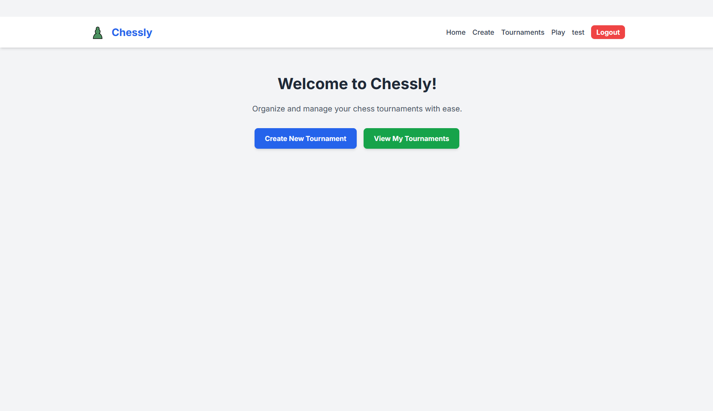
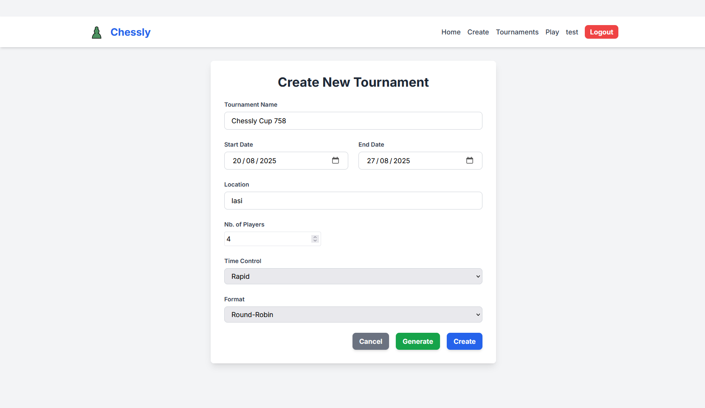
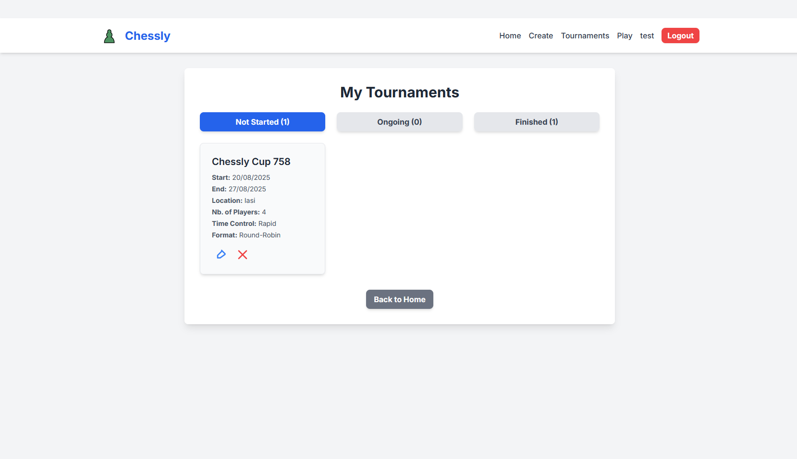
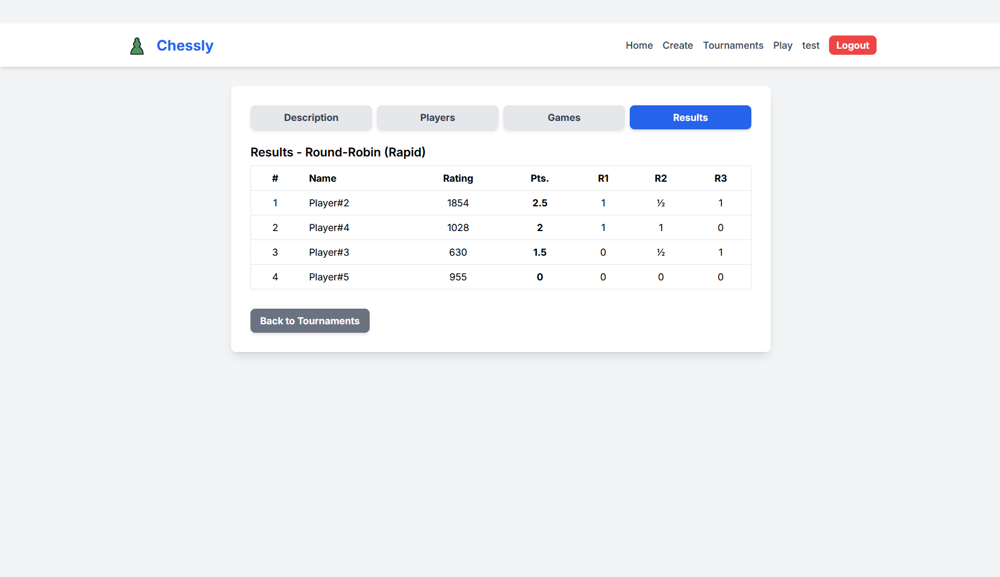
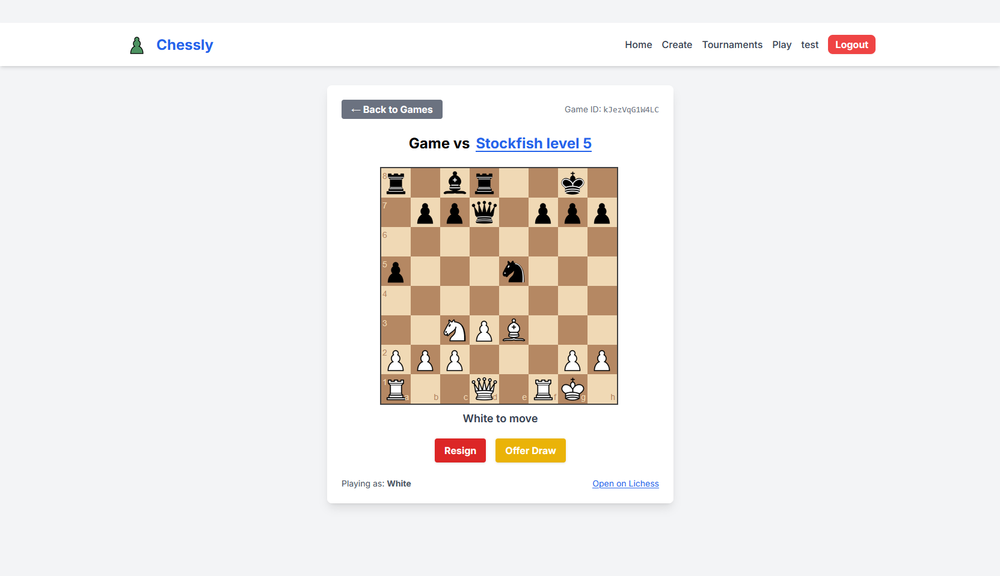

# Chessly

[Live Website](https://chessly-lichess.netlify.app/)
> **Note:** Due to the limitations of the free Render service used to host the server, you might occasionally experience issues accessing or using Chessly.

Chessly is a chess utility web app integrated with the [Lichess API](https://lichess.org/api#section/Introduction).
Users can create and track their own tournaments, play chess games, and manage their chess activities—all in one place.

## Demo Video

[](https://www.youtube.com/watch?v=Twg_43ksTik)

---

## Features

- **Lichess Integration:** Play and track games directly via the Lichess API.
- **Tournament Management:** Create, join, and monitor tournaments.
- **Live Chessboard:** Interactive chessboard powered by [chessboard.js](https://chessboardjs.com/index.html) and [chess.js](https://jhlywa.github.io/chess.js/).
- **User Dashboard:** View stats, ratings, and ongoing games.
- **Modern UI:** Built with TypeScript and Tailwind CSS for a responsive experience.

---

## Pictures






---

## Tech Stack

**Frontend:**
- TypeScript
- Tailwind CSS
- Vite

**Backend:**
- Python
- FastAPI
- PostgreSQL
- Redis
- SQLModel / SQLAlchemy
- Alembic
- Celery
- JWT tokens

---

## Documentation

- [Swagger UI](https://chessly-uamz.onrender.com/api/v1/docs)
- [Redoc](https://chessly-uamz.onrender.com/api/v1/redoc)

---

## Getting Started

### Backend

1. **Go to the project directory:**
    ```bash
    cd chessly/be
    ```

2. **Create a virtual environment:**
    ```bash
    python -m venv .venv
    ```

3. **Activate the virtual environment:**
    - On Windows:
      ```bash
      .venv\Scripts\activate
      ```
    - On macOS/Linux:
      ```bash
      source .venv/bin/activate
      ```

4. **Install dependencies:**
    ```bash
    pip install -r requirements.txt
    ```

5. **Start the FastAPI server:**
    ```bash
    uvicorn src.main:app --reload
    ```
    *(Or use `fastapi dev src/main.py` if you have the FastAPI CLI.)*

---

### Frontend

1. **Go to the frontend directory:**
    ```bash
    cd chessly/fe
    ```

2. **Install dependencies:**
    ```bash
    npm install
    ```

3. **Start the development server:**
    ```bash
    npm run dev
    ```

4. **Open your browser and visit:**
    ```
    http://localhost:5173
    ```
    *(Or the port shown in your terminal.)*

---

## Dependencies

- [Lichess API](https://lichess.org/api#section/Introduction)
- [chessboard.js](https://chessboardjs.com/index.html)
- [chess.js](https://jhlywa.github.io/chess.js/)

---

## Integrations

### Lichess API

To play chess games, you’ll need a Lichess account and a personal API access token.
Generate your token here: [Lichess API Token Generator](https://lichess.org/account/oauth/token)

After generating the token, copy it, navigate to your Chessly profile, paste it into the "Lichess Token" field, and update your profile.

### Discord Webhook Notifications

Chessly can send automated notifications to a Discord channel when key events occur (e.g., when a tournament ends and a winner is determined).

To enable Discord notifications:

1. **Create a Discord webhook:**
   - Go to your Discord server settings → Channel settings → Integrations → Webhooks.
   - Click "New Webhook", copy the webhook URL.

2. **Configure the webhook URL:**
   - Set your Discord webhook URL in the backend configuration's `.env`

3. **How it works:**
   - When a tournament ends, Chessly sends a message to the configured Discord channel announcing the winner.

**Example webhook payload:**
```json
{
  "content": "🏆 Tournament 'Spring Open' has ended! Winner: Andrei (Score: 3.5/5)"
}
```
